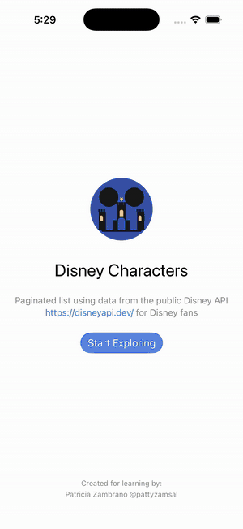

# Disney Characters

A native iOS application that lets you browse, search, and explore Disney characters using the public [Disney API](https://disneyapi.dev/docs/). Built as a learning project to practice Clean Architecture, MVVM, and modern Swift development.

<p align="center">
  
</p>

---

## Table of Contents

- [About the Project](#about-the-project)
- [Tech Stack](#tech-stack)
- [Getting Started](#getting-started)
- [Architecture](#architecture)
- [Dependencies](#dependencies)
- [Testing Strategy](#testing-strategy)
- [Decision Log](#decision-log)

---

## About the Project

Disney Characters connects to the public [Disney API](https://github.com/ManuCastrillonM/disney-api) to display a paginated list of Disney characters. Each character has a detail screen showing their appearances across films, TV shows, video games, park attractions, and more.

**Key features:**
- Paginated character list with infinite scroll
- Debounced search (local cache first, remote fallback)
- Offline support via local cache
- Character detail with full appearance history
- Pull-to-refresh
- Error handling with retry support where applicable
- Accessibility (VoiceOver, Dynamic Type, Reduce Motion)
- Light and dark mode

---

## Tech Stack

| Area | Tool |
|------|------|
| Language | Swift 5.0+ |
| UI | SwiftUI |
| Minimum Target | iOS 26.2 |
| Project Generation | XcodeGen |
| Dependency Manager | Swift Package Manager |
| Linting | SwiftLint |
| Mock Generation | Sourcery |
| Unit Tests | Swift Testing (`import Testing`) |
| Snapshot Tests | swift-snapshot-testing + XCTest |
| Image Loading | Kingfisher |

---

## Getting Started

The `.xcodeproj` is not committed to the repository — it is generated from `Disney Characters/project.yml` using [XcodeGen](https://github.com/yonaskolb/XcodeGen).

### Prerequisites

- macOS with [Homebrew](https://brew.sh/) installed
- Xcode 16 or newer

### Installation

```bash
git clone <repository-url>
cd DisneyCharacters
make install
make open
```

`make install` handles everything in one step: it installs XcodeGen, SwiftLint, and Sourcery via Homebrew, then generates the Xcode project.

### Available Commands

| Command | Description |
|---------|-------------|
| `make install` | Install tools and generate the project (run this first) |
| `make config` | Create missing xcconfig files (called automatically by `make install`) |
| `make generate` | Regenerate the project from `project.yml` after changes |
| `make open` | Open the project in Xcode |
| `make mocks` | Manually regenerate Sourcery mocks (also runs automatically on every test build) |
| `make lint` | Run SwiftLint |

### Running Tests

The project uses **test plans** to run unit and snapshot tests independently:

```bash
# Unit tests only (default when pressing Cmd+U)
xcodebuild test -scheme DisneyCharactersTests -testPlan UnitTests \
  -destination 'platform=iOS Simulator,name=iPhone 16'

# Snapshot tests only
xcodebuild test -scheme DisneyCharactersTests -testPlan SnapshotTests \
  -destination 'platform=iOS Simulator,name=iPhone 16'

# Everything
xcodebuild test -scheme DisneyCharactersTests -testPlan AllTests \
  -destination 'platform=iOS Simulator,name=iPhone 16'
```

You can also switch plans inside Xcode via `Product → Test Plan`.

---

## Architecture

The project follows **Clean Architecture** with an **MVVM** presentation layer. The dependency rule is strict: outer layers depend on inner ones, never the reverse.

```
┌─────────────────────────────────────────┐
│             Presentation Layer           │
│  Views (SwiftUI) ↔ ViewModels           │
│  PresentationModels · Mappers · Router  │
├─────────────────────────────────────────┤
│               Domain Layer               │
│  UseCases · Entities · Repository       │
│  Protocols · DomainError                │
│                                         │
│  No dependency on Data or Presentation  │
├─────────────────────────────────────────┤
│                Data Layer                │
│  Repository (impl) · Remote · Local     │
│  DTOs · Mappers · NetworkClient         │
├─────────────────────────────────────────┤
│              Core / DI                   │
│  DependencyContainer · AppRouter        │
│  Network · Configuration · Extensions  │
└─────────────────────────────────────────┘
```

### Layer responsibilities

**Domain** — Pure Swift. Defines entities (`DisneyCharacter`, `PaginationInfo`), use case protocols, repository contracts, and `DomainError`. No `import Foundation` unless a Foundation type is actually used (avoids `@MainActor` isolation warnings in Swift 6).

**Data** — Implements domain protocols. `DefaultCharacterRepository` applies a cache-first strategy: it returns cached data immediately and only hits the network when the cache is cold. DTOs are mapped to domain entities via `CharacterDTOMapper`.

**Presentation** — ViewModels are `@Observable @MainActor final class`. They call use cases, map results to presentation models, and expose a single `viewState: ViewState<T>` property. Views observe ViewModels and never touch use cases or repositories directly.

**Core / DI** — A lightweight `DependencyContainer` holds shared long-lived dependencies (repository). Per-screen **Assemblers** (caseless enums) receive the container and build the ViewModel + View for each route. Assemblers live next to their feature, not in a central DI folder.

### ViewState

Every screen shares the same state enum:

```swift
enum ViewState<T> {
    case idle
    case loading
    case loaded(T)
    case error(String, isRetryable: Bool)
}
```

`isRetryable` drives whether the retry button is shown in `ErrorView`:
- `false` — no connection, character not found (retrying immediately won't help)
- `true` — network failure, unexpected error (transient, worth retrying)

### Navigation

Navigation uses a single `NavigationStack` with a path driven by `AppRouter` (`@Observable`). Routes are typed via `AppRoute` enum. This keeps navigation logic out of Views.

---

## Dependencies

All dependencies are managed with **Swift Package Manager**.

| Package | Version | Purpose |
|---------|---------|---------|
| [Kingfisher](https://github.com/onevcat/Kingfisher) | ≥ 8.9.0 | Async image loading and caching |
| [swift-snapshot-testing](https://github.com/pointfreeco/swift-snapshot-testing) | ≥ 1.19.2 | Snapshot tests for all Views |

**Tooling (installed via Homebrew, not SPM):**

| Tool | Purpose |
|------|---------|
| [XcodeGen](https://github.com/yonaskolb/XcodeGen) | Generates `DisneyCharacters.xcodeproj` from `project.yml` |
| [SwiftLint](https://github.com/realm/SwiftLint) | Enforces code style at build time |
| [Sourcery](https://github.com/krzysztofzablocki/Sourcery) | Auto-generates protocol mocks for testing |

---

## Testing Strategy

### Unit Tests — Swift Testing framework

Written with `import Testing`, `@Test`, and `#expect()`. Each layer is tested independently:

- **Data:** DTO mappers, repository cache/remote logic
- **Domain:** All three use cases
- **Presentation:** Presentation mappers, both view models

Dependencies are mocked using Sourcery-generated mocks. The mocks regenerate **automatically** on every `DisneyCharactersTests` build via a `preBuildScripts` entry in `project.yml` — protocol changes never lead to stale mocks. The generated file (`AutoMockable.generated.swift`) is gitignored as a build artifact. Use `make mocks` when you want to regenerate manually outside of a build (e.g. to inspect the diff before opening Xcode).

### Snapshot Tests — XCTest + swift-snapshot-testing

Snapshot tests live in the **unit test target** (`DisneyCharactersTests/SnapshotTests/`), not in the UITests target. This is intentional: Xcode 16 forces `-module-alias Testing=_Testing_Unavailable` on all UI test bundles, making swift-snapshot-testing (which links against Testing.framework since 1.17+) permanently incompatible with UITest targets.

Each screen is tested in: light mode, dark mode, iPhone SE, and Dynamic Type `accessibilityExtraExtraExtraLarge`.

**Reference images are committed** to `DisneyCharactersTests/SnapshotTests/__Snapshots__/`, so fresh clones run green without a recording step.

**Pinned recording environment:** always re-record on the **iPhone 16 / iOS 26.2** simulator. Different simulators or OS versions render text and gradients differently and will produce non-deterministic diffs:

```bash
xcodebuild test -scheme DisneyCharactersTests -testPlan SnapshotTests \
  -destination 'platform=iOS Simulator,name=iPhone 16,OS=26.2'
```

### Test Plans

Three test plans live in `TestPlans/`:

| Plan | What it runs |
|------|-------------|
| `UnitTests` *(default)* | All unit tests — skips snapshot classes |
| `SnapshotTests` | All snapshot tests — skips unit classes |
| `AllTests` | Everything |

`Cmd+U` always runs the `UnitTests` plan, keeping the default feedback loop fast. Snapshot tests are run explicitly when UI changes need verification.

---

## Decision Log

Key decisions made during development and the reasoning behind them.

### Assemblers live inside their feature folder, not in `App/DI/`

Each screen's assembler (`CharacterListAssembler`, `CharacterDetailAssembler`) lives alongside its View and ViewModel. A central `App/DI/` assemblers folder would become a bottleneck as the app grows — every new screen would require touching it. Feature-level co-location means adding, removing, or refactoring a screen only touches one folder. `DependencyContainer` stays in `App/DI/` because it owns shared cross-feature state.

### `@Observable` over Combine

The project uses the iOS 17 Observation framework (`@Observable`) instead of Combine. Observable integrates directly with SwiftUI's rendering engine with less boilerplate, no `AnyCancellable` management, and no `@Published` noise. Combine is not used anywhere in the codebase.

### Cache-first repository strategy

`DefaultCharacterRepository` returns cached data immediately and fetches from the network only when the cache is cold. Search queries filter the local cache first and only fall back to the remote API if no local match is found — remote results are then merged into the cache. This gives the app offline support and reduces unnecessary network calls. Pull-to-refresh bypasses the cache via an explicit `forceRefresh: true` flag so users can always retrieve fresh data on demand.

### `CancellationError` handled silently in all ViewModels

Every `async` method in every ViewModel catches `CancellationError` before the generic `catch` block and returns without setting an error state. SwiftUI's `.task {}` modifier cancels in-flight tasks when a view disappears; treating cancellation as an error would show a spurious error screen to the user.

### Snapshot tests in the unit test target

Moving snapshot tests to `DisneyCharactersUITests` was the natural first instinct, but Xcode 16 makes this impossible: the UI test bundle type forces `-module-alias Testing=_Testing_Unavailable` regardless of build settings, and swift-snapshot-testing 1.17+ links against `Testing.framework`. The solution was to keep snapshot tests in `DisneyCharactersTests` (the unit test target) and use **test plans** to run them independently from unit tests.

### XcodeGen for project generation

The `.xcodeproj` is generated from `project.yml` and is not committed to git. This eliminates merge conflicts on the project file, makes the project setup reproducible with a single `make install` command, and keeps the repository clean. All project configuration (targets, build settings, SPM packages, schemes, test plans) lives in a single readable YAML file.

### Global uniqueness for snapshot test method names

Xcode copies snapshot reference PNGs flat into the test bundle — there are no subdirectories per test class. Two snapshot test classes with the same method name (e.g. `test_accessibilityExtraExtraExtraLarge`) produce a "Multiple commands produce" build error. All snapshot test methods are prefixed with a screen identifier (e.g. `test_row_`, `test_detail_`) to prevent collisions.
